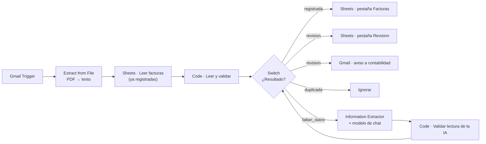

# Guía técnica: lectura automática de facturas

Cómo poner el flujo en producción, cómo está construido y qué límites tiene.
Para probarlo rápido basta el [README](README.md).

---

## 1. Arquitectura



| Nodo | Qué hace |
| --- | --- |
| **Gmail · Factura recibida** | Revisa el correo cada minuto buscando mensajes con PDF adjunto y descarga los adjuntos. |
| **Extraer texto del PDF** | Nodo *Extract from File*, operación PDF. Lee el primer adjunto (`attachment_0`). |
| **Sheets · Leer facturas** | Trae las facturas ya registradas para detectar duplicados. Configurado con *Execute Once* y *Always Output Data*, así funciona aunque la hoja esté vacía. |
| **Leer y validar factura** | Lee los campos del texto, valida y decide el estado. |
| **¿Resultado?** | Reparte por estado: `registrada`, `revision`, `duplicada`, `faltan_datos`. |
| **IA · Leer factura** | Solo para `faltan_datos`. Devuelve los campos como texto. |
| **Validar lectura de la IA** | El mismo código en modo IA: normaliza lo que devolvió el modelo y aplica las mismas reglas. Nunca devuelve `faltan_datos`, así que el regreso al Switch no puede formar un bucle. |

Los dos nodos Code salen del mismo archivo, `workflows/src/validar_factura.js`.
El build solo cambia dos constantes: `MODO` (`texto` o `ia`) y `REGISTRO`
(`memoria` en la demo, `sheets` en producción).

---

## 2. Puesta en producción

### 2.1 Correo

Lo ideal es una casilla solo para facturas (por ejemplo `facturas@empresa.pe`)
o una etiqueta de Gmail con un filtro. Así el trigger no revisa correos
personales. Ajusta la búsqueda en el nodo **Gmail · Factura recibida** (campo
*Search*): por defecto es `has:attachment filename:pdf`.

Crea la credencial **Gmail OAuth2** en n8n y asígnala al trigger y al nodo
**Gmail · Avisar a contabilidad**.

### 2.2 Hoja de cálculo

Una Google Sheet con dos pestañas, **Facturas** y **Revision**, ambas con estas
columnas en la fila 1:

```
clave | estado | ruc_emisor | serie | numero | fecha | moneda | base | igv | total | leida_por | observaciones
```

| Columna | Qué guarda |
| --- | --- |
| `clave` | RUC emisor + serie + número. Es lo que se usa para detectar duplicados. |
| `leida_por` | `texto` si se leyó del PDF, `ia` si la leyó el modelo. Sirve para auditar cuántas necesitaron IA. |
| `observaciones` | Motivos de revisión, separados por `;`. |

### 2.3 Modelo de IA

El workflow trae **OpenAI Chat Model** con `gpt-4o-mini` y temperatura 0 (para
que la lectura sea lo más literal posible). Se puede reemplazar por cualquier
otro modelo de chat de n8n sin tocar el resto.

### 2.4 Reemplazos

| Nodo | Qué reemplazar |
| --- | --- |
| Los 3 nodos de Google Sheets | `REEMPLAZAR_ID_HOJA` → ID que aparece en la URL de la hoja; credencial de Google |
| Gmail · Avisar a contabilidad | `REEMPLAZAR_CORREO_CONTABILIDAD` |
| Modelo de IA | Credencial del proveedor |

### 2.5 Datos de la empresa

El RUC de la empresa que recibe las facturas está en la constante
`RUC_EMPRESA` de `workflows/src/validar_factura.js` y `src/facturas.py`.
Cámbialo en los dos archivos (el test de paridad avisa si quedan distintos) y
corre `python scripts/build_workflow.py`.

---

## 3. Límites conocidos

- **PDF escaneado como imagen.** No tiene texto, así que *Extract from File*
  devuelve vacío y la factura pasa a la IA con texto vacío, que termina en
  revisión. Para esos casos haría falta un paso de OCR (por ejemplo, un modelo
  con visión) antes de la lectura.
- **Un PDF por correo.** El flujo lee `attachment_0`. Si un proveedor manda
  varias facturas en un mismo correo, habría que agregar un nodo que separe los
  adjuntos en items.
- **Facturas en otra moneda que no sea soles o dólares** quedan con `moneda`
  vacía y van a la IA.
- **Duplicados dentro de un mismo lote.** Si llegan dos correos con la misma
  factura en el mismo minuto, el primer nodo Code los detecta. Pero si uno se
  lee por texto y el otro por IA, cada nodo tiene su propio registro y podrían
  registrarse los dos. Es un caso muy raro; la clave en la hoja permite
  encontrarlo.

---

## 4. Decisiones de diseño

- **Primero reglas, después IA.** La lectura por etiquetas es gratis,
  instantánea y se puede probar. La IA solo entra cuando la necesita, y lo que
  devuelve no se cree sin validarlo.
- **Montos en céntimos enteros**, para que Python y JavaScript den exactamente
  lo mismo.
- **Una factura con problemas no entra al registro.** Así, si se corrige y se
  reenvía, no se marca como duplicada.
- **Sin credenciales en el repositorio.** Los workflows usan marcadores
  `REEMPLAZAR_*` y un test revisa que no haya claves ni correos reales.

---

## 5. Problemas de n8n encontrados al probar

- **Cuando falla el sub-nodo del modelo, el extractor no usa la salida de
  error.** Con *On Error → Continue (using error output)*, un error del modelo
  (por ejemplo, sin credencial) sale por la salida normal con un campo `error`
  y sin `output`. Por eso el nodo **Validar lectura de la IA** revisa si llegó
  `output`. Si no llegó, manda la factura a revisión con el motivo "la IA no
  pudo leer la factura", conservando lo que sí se leyó del PDF.
- **Reimportar un workflow activo no cambia la versión activa** (n8n 2.x):
  desactívalo, impórtalo y vuelve a activarlo.
- **El nodo Webhook guarda el archivo subido con el nombre del campo del
  formulario.** Por eso la demo usa el campo `factura` y el nodo *Extract from
  File* lee `factura`; en producción, Gmail lo llama `attachment_0`.
