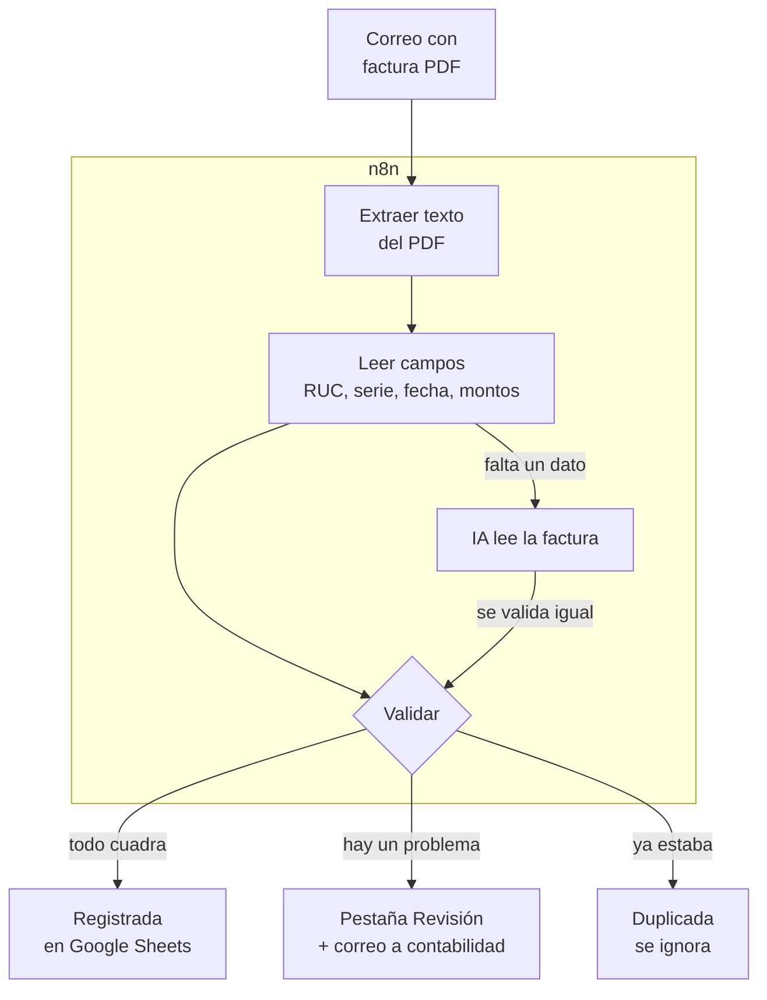
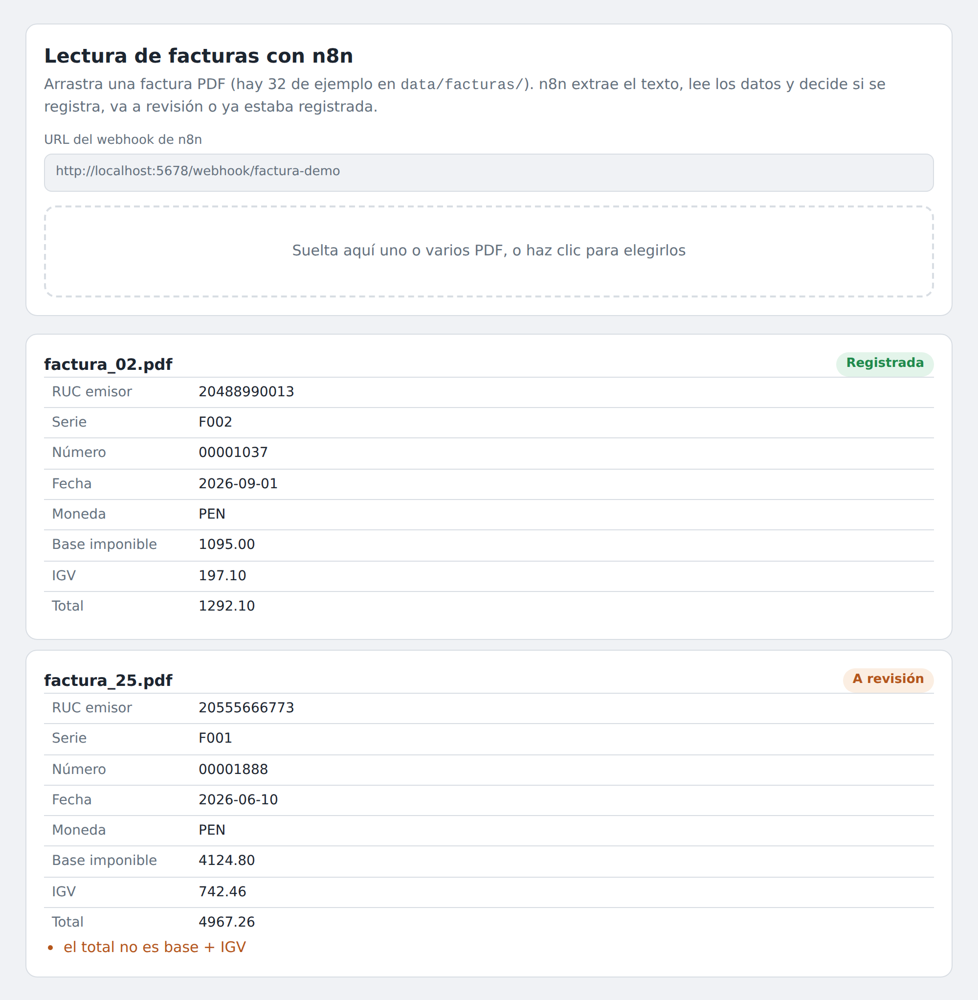

<h1 align="center">Lectura automática de facturas con n8n</h1>

<p align="center"><i>La factura llega por correo y termina registrada y validada, sin que nadie la digite</i></p>

<p align="center">
  
  
  
  
  
</p>

---

## Para qué existe este repositorio

Los proveedores mandan sus facturas en PDF a un correo. Alguien de contabilidad abre cada una, copia RUC, serie, fecha y montos a una hoja, y revisa a ojo si el IGV está bien calculado. Es lento, se cuelan errores de tipeo y una factura reenviada se puede registrar dos veces.

**Este flujo lee cada PDF que llega al correo, extrae los datos, los valida con las reglas de SUNAT y los registra en Google Sheets. Solo le llegan a una persona las facturas que tienen un problema, con el motivo escrito.**



---

## Demo

<!-- VIDEO: arrastra aquí el .mp4 al editar el README en GitHub y deja solo la URL que genera. -->

<p align="center"></p>

<p align="center"><i>Dos PDFs enviados al workflow de n8n: uno se registra y el otro va a
revisión porque el total no es la base más el IGV.</i></p>

---

## Qué valida

Términos que conviene conocer:

- **RUC:** número de 11 dígitos que identifica a cada contribuyente en el Perú. El último es un **dígito verificador** calculado con el algoritmo módulo 11 de SUNAT, así que un RUC mal tipeado o inventado se detecta sin consultar a nadie.
- **Base imponible** (en la factura: "Op. Gravada", "Valor de venta" o "Subtotal"): el monto sobre el que se calcula el impuesto.
- **IGV:** el impuesto general a las ventas, 18 % de la base.
- **Serie y número:** por ejemplo `F001-00001234`. Junto con el RUC del emisor, identifican una factura de forma única.

| Regla | Si falla |
| --- | --- |
| El RUC del emisor tiene el dígito verificador correcto | A revisión: "RUC del emisor inválido" |
| La factura está a nombre de nuestra empresa | A revisión: "factura emitida a otro RUC" |
| La fecha de emisión no es futura | A revisión |
| El IGV es el 18 % de la base (±1 céntimo por redondeo) | A revisión |
| El total es base + IGV | A revisión |
| RUC + serie + número no están ya registrados | Duplicada: no se registra otra vez |

Una factura con problemas **no entra al registro**. Si el proveedor la corrige y la reenvía, se registra normalmente.

---

## Dónde entra la IA

Cada proveedor usa su propio sistema de facturación: uno escribe "Op. Gravada", otro "Valor de venta", otro "SUB TOTAL". La lectura por etiquetas cubre esas variantes sin costo.

Solo cuando al PDF le falta alguna etiqueta, el flujo le pasa el texto a un modelo de IA (nodo **Information Extractor** de n8n). Lo que devuelve la IA **pasa por las mismas validaciones**: si inventa un monto, el IGV o el total no cuadran y la factura va a revisión. Además, el prompt le prohíbe calcular datos que no aparecen.

Si la IA falla o no hay saldo, la factura va a revisión con ese motivo. Nunca se registra una factura a medias.

---

## Probarlo en 2 minutos

```bash
pip install pytest
python scripts/generar_facturas.py   # 32 facturas PDF ficticias
python scripts/evaluar_lectura.py    # lectura y decisión de cada una
python -m pytest -v                  # 64 tests
```

**Con n8n de verdad** (Docker):

```bash
docker compose up -d
docker exec facturas_n8n n8n import:workflow --input=/workflows/facturas_demo.json
docker exec facturas_n8n n8n update:workflow --id=facturasdemo --active=true
docker restart facturas_n8n
```

Abre `demo/index.html` y arrastra PDFs de `data/facturas/`. Si subes el
mismo archivo dos veces, la segunda sale como duplicada. La configuración de
producción (Gmail, Google Sheets y modelo de IA) está en [`GUIA.md`](GUIA.md).

---

## Cómo se mide que funciona

`scripts/generar_facturas.py` crea 32 facturas con semilla fija, en 3
formatos de proveedor distintos, y anota qué debe pasar con cada una. Incluye
a propósito los casos difíciles: RUC con dígito verificador equivocado, IGV
inflado, total que no cuadra, fecha futura, factura a nombre de otra empresa,
montos en dólares, reenvíos duplicados y PDFs sin la etiqueta del IGV o del total.

| Resultado | |
| --- | --- |
| Campos bien leídos | 256 de 256 |
| Decisiones correctas (con el motivo correcto) | 32 de 32 |
| Registradas / a revisión / duplicadas / pasan a la IA | 23 / 5 / 2 / 2 |

Son facturas generadas, no reales: prueban que cada regla funciona, no que
se lea cualquier PDF del mercado. Un PDF escaneado como imagen, por ejemplo,
no tiene texto que extraer (ver [`GUIA.md`](GUIA.md)).

---

### El detalle que más cuesta ver

Los montos nunca se manejan con decimales, sino en **céntimos enteros**. En JavaScript `0.1 + 0.2` no da `0.3`, y la misma lógica corre en Python (para probarla) y en JavaScript (dentro de n8n). Con decimales, una factura podía pasar la validación en un lado y fallar en el otro.

Un test **ejecuta el código de los nodos de n8n fuera de n8n** y compara factura por factura contra Python, incluidos textos con símbolos como `º`. Por eso las expresiones regulares usan *lookarounds* en vez de `\b`: en Python `\b` reconoce letras Unicode y en JavaScript no.

---

## Estructura

```
├── data/
│   ├── facturas/                 # 32 PDFs ficticios y su texto
│   └── esperado.csv              # qué debe leer y decidir el flujo en cada una
├── src/facturas.py               # lectura, validación y decisión
├── workflows/
│   ├── src/validar_factura.js    # el código de los dos nodos Code
│   ├── facturas_demo.json        # importable, corre SIN credenciales
│   └── facturas_produccion.json  # Gmail + IA de respaldo + Google Sheets
├── demo/index.html               # sube PDFs al webhook y muestra el resultado
├── scripts/                      # generador de facturas, build y evaluación
├── tests/                        # 64 tests (incluye paridad JS ↔ Python)
└── docker-compose.yml            # n8n self-hosted
```

---

## Flujo de trabajo con Git

El repositorio sigue **Git Flow**: `main` siempre desplegable, `develop` como
integración, y una rama por cambio. Los merges son `--no-ff` para que cada
funcionalidad quede como un bloque legible en el historial, y cada versión
lleva su tag.

| Rama | Para qué |
| --- | --- |
| `main` | Solo versiones liberadas. Cada merge lleva su tag. |
| `develop` | Integración de todo lo terminado. |
| `feature/*` | Una funcionalidad nueva. |
| `fix/*` | Una corrección concreta. |
| `release/*` | Preparación de la versión; luego se fusiona a `main` y `develop`. |

Los mensajes siguen [Conventional Commits](https://www.conventionalcommits.org/):
`feat:`, `fix:`, `test:`, `docs:`, `chore:`, con el porqué del cambio en el cuerpo.

---

## Documentación

| Documento | Contenido |
| --- | --- |
| [`GUIA.md`](GUIA.md) | Puesta en producción, arquitectura, límites y problemas de n8n encontrados al probar |
| [`CHANGELOG.md`](CHANGELOG.md) | Cambios por versión |

---

## Licencia

[MIT](LICENSE) · Daniel Yataco Blas

> Proyecto de demostración construido con **datos ficticios**. Las empresas,
> RUC y facturas no existen; los RUC tienen dígito verificador válido solo
> para poder probar la validación.
